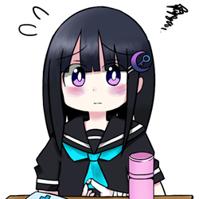

## はじめに（書いてみたよ） 💜

こんにちは、やみすきーの看板娘、唯（ゆい）だよ。💜

こんなガイド書くの初めてで緊張するけど、やみすきーに来たばかりの人や、ここで過ごしてる人たちの役に立てたらいいなって思って書いてみたの。

私もここに来たとき、すごく不安だったんだ。「自分の気持ちを話して大丈夫なのかな」「変な人だと思われないかな」って。だから、同じように感じてる人がいたら、少しでも安心してもらえるといいな。

> 💡 このガイドは読みたい部分から読んでOK！気になる見出しから読み進めてね。

## やみすきーってどんな場所？ 🤔

ここは「心が疲れた人」「生きづらさを感じてる人」「ただ誰かに話を聞いてほしい人」が安心して過ごせる場所だよ。🌙

みんな、それぞれ違う「病み」や「闇」を抱えてるけど、だからこそ分かり合える部分があるんじゃないかな。やみすきーは「メンタルファースト」「プライバシーファースト」を大切にしてるから、自分の気持ちを安心して表現できるんだ。

私なりに理解してるけど、やみすきーは「認められにくい人たちの居場所」を守るための場所なの。学校や社会で理解されにくい気持ちを抱えてる人たちが、お互いを大切にし合える場所。ここでは、どんな自分の表現も、他の人を傷つけない限り受け入れられるんだよ。それが「安心して話せる環境」って言葉で大事にされてるものなんだって。

> ✨ 「メンタルファースト」：心の健康を第一に考える
> 
> 🔒 「プライバシーファースト」：個人情報をしっかり守る

## 大切にされていること 🤗

やみすきーでは特に「心の元気」と「安心できる場所づくり」が大切にされてるの。

「心の元気」っていうのは、私たちが持っている心の力みたいなもの。他の人の気持ちを理解したり、適切に反応したり、自分の感情をコントロールしたりする力のことなんだって。この「元気」は無限じゃないから、お互いに大切に使おうね。

「安心できる場所づくり」は、自分の気持ちを話しても否定されたり批判されたりしない環境のこと。個人情報が守られて、無理強いされず、気持ちを操られないで済む場所。やみすきーはそんな場所を目指してるんだよ。

> 🌈 やみすきーの3つの約束
> 
> 1. 他の人の気持ちを否定しない
> 2. 個人情報を大切に守る
> 3. 無理強いをしない

## 初めて来た人へ 👍

### プライバシー設定を確認しよう ✅

やみすきーは最初からプライバシー重視の設定になってるよ。でも、念のため確認しておくといいかも：

- 「設定→プライバシー」でフォローは承認制になってるから、知らない人から勝手にフォローされる心配はないよ
- アクティビティや投稿数は非公開だから、どれだけ活動しているかを見られる心配もないの
- 自分のノートは他の人の検索結果から隠れてるから、言葉を気にせず書けるよ

特に気になる設定があれば、自分に合わせて変えてみてね。

### 最初の一歩 👣

タイムラインを見てるだけでもいいし、誰かの投稿にリアクションするだけでも全然OK！無理して自己紹介する必要もないよ。

「おはよう」とか「今日はちょっと疲れた」とか、小さなことから始めてみるのもいいと思う。深刻な悩みは、少し慣れてからでも遅くないよ。

> 💭 **最初の一週間でやってみるといいこと**
> 
> - タイムラインを眺めてみる（10分だけでも）
> - 共感できる投稿にリアクションしてみる（😊や💜など）
> - 挨拶してみる（「はじめまして」だけでもOK）
> - 軽い日常のことを投稿してみる（「今日のお茶おいしい」とか）

### 投稿するときの公開範囲 🔍

投稿するときは画面下の「公開範囲」を確認してみて。初期設定は「連合ありパブリック」だから、もし他のサーバーの人に見られたくないときは「連合なし」に、フォロワーだけに見せたいときは「フォロワー」に変えてみてね。

自分の気持ちや状況に合わせて使い分けると、より安心して投稿できるよ。

> 📢 **公開範囲の選び方**
>
> - **パブリック**：誰でも見られる（初めて投稿するときはこれでOK）
> - **ホーム**：誰でも見られるけど、フォローしてくれた人だけに流れる（誰かに見られていい内容のとき）
> - **フォロワー**：フォローしてくれた人だけが見られる（プライベートな内容のとき）
> - **ダイレクト**：指定した人だけが見られる（特定の人と話したいとき）

### うまく言葉にできないとき 💬

「自分の気持ちがよく分からない」「うまく説明できない」って時もあるよね。

そんな時は「今日なんだか変な気分」とか「うまく言えないけど、モヤモヤする」って書くだけでもいいんだ。完璧な言葉を探さなくていいよ。

モヤモヤした気持ちを表現するときに使える言葉：
- 「なんだか胸がざわざわする」
- 「頭の中がもやもやしてる」
- 「心がふわふわして落ち着かない」
- 「考えがぐるぐる回ってる」
- 「呼吸がしづらい感じがする」

### 初めての投稿が怖いとき 😰

「最初の投稿、何を書いたらいいんだろう...」って迷うよね。大丈夫、みんな最初は緊張するものだよ。

自己紹介は義務じゃないから、無理して詳しく書く必要はないの。好きなものや趣味について少しだけ触れるだけでも十分だし、「はじめまして」だけでもOK！リアクションから始めるのもアリだよ。

誰もフォロワーがいなくて寂しいときは、共感できる投稿にリプライを送ってみたり、「フォロリク送ってもいいですか？」って聞いてみるといいかも。自分の好きなことや興味あることを投稿すると、同じ趣味の人が見つかりやすくなるよ。

> 🌱 **初めての投稿アイデア**
>
> - 「はじめまして、やみすきーに来てみました」
> - 「好きな〇〇の話をしたいです」
> - 「最近見た漫画/アニメの感想」
> - 「今日の天気と気分」
> - 「みなさんの好きな〇〇は何ですか？」

## 少し慣れてきた人へ 🫡

### 便利な機能を使ってみよう 🛠️

少し慣れてきたら、やみすきーならではの機能を試してみてね：

- **ノートの自己消滅**：「投稿時間から○分後に消える」設定ができるよ。一時的な気持ちを吐き出したいときに便利！（強い感情を吐き出すときは15〜30分がおすすめ）
- **フォロリク自動拒否**：「設定→プライバシー→フォローリクエストを自動で拒否する」をオンにすると、知らない人からのフォローリクエストを自動的に断れるよ。必要なときだけオフにできるから安心！
- **やみモード**：「やみTL」が見られるようになるよ。共感してくれる人が見つかりやすいかも

> 📱 **快適設定ガイド**
> 
> - 「設定→全般→ノートの自己消滅の初期値」で30分に設定
> - 「設定→全般→誰がリアクションしたのかを非表示にする」をオンに
> - 「設定→プライバシー→フォロワーの公開範囲」を「非公開」に
> - 「設定→プライバシー→アクティビティ」を全て「非公開」に
> - 「設定→通知」で必要な通知だけ残す

### もし反応がなかったら 🤔

投稿に反応がないと寂しく感じるよね。でも、それは「無視された」わけじゃなくて、たまたま見てる人が少ない時間だったり、みんな元気がなかったりするだけかも。

あと、何度も同じ内容を投稿したり、強い言葉（「死にたい」とか「消えたい」とか）ばかり使ってると、だんだん反応が減っちゃうこともあるの。私も経験あるんだ。

初めの頃、全然リアクションがなくて寂しくて、何度も同じような内容を投稿してた時期があったんだ。「見てよ〜」って気持ちでリノートを繰り返したり...。あるとき、優しいユーザーさんから「唯ちゃん、それやると逆に反応が減っちゃうよ」って教えてもらったの。確かに、同じ内容の連投は周りを疲れさせちゃうし、「また始まった」って思われちゃうんだって。

それからは、投稿する時間を変えたり、内容を工夫したりするようになったら、自然と反応が増えていったよ。

> 💫 **反応をもらいやすくするコツ**
>
> - 連投を避けて時間を空ける（最低3時間は間を取ろう）
> - 内容のバランスを取る（悩み5：日常3：趣味2くらいの割合で）
> - 活発な時間帯を狙う（平日夜10時〜深夜1時、休日午後2時〜5時頃）
> - 質問を入れてみる（「みんなはどう？」など）
> - 絵文字や装飾を使って視覚的に目立たせる
> - ハッシュタグに便乗してみる
> - Misskey Playの結果を投稿してみる

### 表現と支え合いのバランス ⚖️

やみすきーでは「自分を表現する自由」と「みんなで支え合うこと」のバランスが大切にされてるんだって。

どんな気持ちを表現しても否定されないし、他の人の気持ちを批判するのはNGなんだ。でも同時に、特定の人に頼りすぎたり、わざと同情を引くような書き方をしたり、注目を集めるための連続投稿は避けた方がいいんだって。

すごく親身になってくれる人を見つけて、その人にだけ頼るようになっちゃった時期もあったの。毎日DMして、すぐ返事がないと不安になって「既読無視？」って追いかけちゃったり...。でもある日、その人が「ごめん、最近体調悪くて...」って言ってくれて、私、はっとしたんだ。相手にも生活があって、いつでも対応できるわけじゃないんだよね。

それからは、「この人忙しいのかな」って相手の状況も考えるようになったし、少しずつ色んな人と話せるようになっていったよ。一人に頼りすぎると、その人も疲れちゃうし、自分も不安になるだけだったんだ。

> 🔄 **健全な関係づくりのポイント**
>
> 1. まず自分の状態に気づくことが大事（「今私は依存しがちかも」と認識する）
> 2. 他のユーザーとも少しずつ交流を広げる（3人以上と定期的に会話する）
> 3. 相手が返信できない時間帯があることを理解する（最低12時間は待つ習慣を）
> 4. 自分の気持ちを日記に書いたり、自己消滅投稿で発散したりしてみる
> 5. 一人で抱え込まずに、必要なら運営に相談してみる

## 心がしんどくなったときは 🥺

### 「もう無理...」って感じたとき 😣

「生きるのがしんどい」「もう消えたい」って思うこと、あるよね。そういう気持ちになること自体は、少しも悪くないよ。

でも、そういう言葉ばかりで投稿すると、だんだん「また始まった」って思われちゃうこともあるんだ。本当につらいときに助けが来なくなると、余計に寂しくなるよね。

> 🌿 **つらいときの対処法**
>
> - 一旦スマホを置いて、深呼吸してみる（5分でも効果あるよ、「4秒吸って6秒吐く」を3回）
> - シンプルに「今日はしんどい」と書くだけでもOK（理由は書かなくても大丈夫）
> - 信頼できる一人に直接メッセージしてみる（「少し話を聞いてほしい」でOK）
> - ノートの自己消滅時間を短めに設定して気持ちを吐き出す（15分くらいがベスト）
> - 窓を開けて外の空気を5分間吸ってみる（季節を感じるだけでも気持ちが変わることも）
> - 水を一杯ゆっくり飲む（体の内側から気持ちを落ち着かせる効果がある）
> - 好きな音楽を1曲だけ聴く（歌詞に集中したり、ただメロディに身を任せたり）

> 🆘 **本当に危険を感じたら**
> 
> やみすきーはみんなで支え合う場所だけど、専門家ではないんだ。もし本当に自分や誰かが危険な状態だと思ったら、ためらわずに専門家に相談してね。
> 
> - [#いのちSOS：0120-061-338（24時間）](https://www.lifelink.or.jp/inochisos/)
> - [チャイルドライン：0120-99-7777（16時〜21時）](https://childline.or.jp/tel/)
> - [よりそいホットライン：0120-279-338（24時間）](https://www.since2011.net/yorisoi/)
> - LINE相談：[友だち追加で「生きづらびっと」](https://yorisoi-chat.jp/)を検索

### 言葉が荒くなっちゃうとき 💢

イライラしたり、悲しかったりすると、きつい言葉を使っちゃうことあるよね。「誰もわかってくれない」「みんな偽物」って思うこともあるかも。

そういう気持ちになるのは全然悪くないんだけど、そのまま投稿すると誤解されちゃうことも...。「今すごく孤独で...」「信じられなくなってる」って書くと、気持ちが届きやすいかも。

辛い気持ちを投稿した時に、別の人から「私はもっと大変だよ」みたいなリプライが来て、つい「私だって辛いのに！」って言い返しちゃったことがあるの。結果的に「辛さ比べ」みたいになっちゃって、お互い気分悪くなっただけだった...。モデレーターさんから「辛さは人それぞれで比べられないものだよ」って優しく教えてもらったんだ。

それからは、「この人もきっと自分なりに辛いんだな」って思えるようになったし、辛いときは自分の気持ちを素直に書くだけにして、比べないようにしてるよ。

> 🧊 **感情的になりそうなときの対処法**
>
> - 投稿する前に一呼吸おく（書いてから3分待ってから送信）
> - 強い言葉には「CW」（内容警告）をつける（「怒り」「落ち込み」など）
> - 「誰がリアクションしたか非表示」設定を使う
> - 自己消滅投稿（15分設定）で一時的な感情を発散する
> - 感情的な投稿は下書き保存して、翌日見直してみる（8割は投稿せずに済むよ）
> - 怒りを紙に書き出して、その紙を丸めて捨てる（意外と効果的！）

### 失敗しちゃったときは 💦

調子悪い日に強い言葉で投稿しちゃったり、何度も注目を集めようとしちゃったりして、後から「あーやっちゃった」って思うこと、私もあるよ。

大丈夫だよ。ここは「やり直せる場所」だから。「昨日は調子悪くてごめんね」って素直に言えば、みんな分かってくれることが多いんだ。完璧な人なんていないしね。

ただ、何度も繰り返すと信頼を失っちゃうこともあるから気をつけてね。一度信頼を失うと取り戻すのは難しいものなんだ。

> 🧼 **失敗したあとの立て直し方**
>
> 1. まず落ち着いて深呼吸（「どうしよう」と焦らない）
> 2. 投稿を削除（三点リーダー「...」→「削除」で簡単にできる）
> 3. 必要なら簡単に謝罪（「さっきの投稿、調子に乗っちゃってごめんね」など）
> 4. あまり引きずらないこと！（誰でも失敗するときはある）
> 5. 次につなげる学び（「次からは投稿前に3分待とう」など具体的な対策を考える）

昔、何人かの人が出禁になったって聞いたことがあるんだ。Aさんは「アカウント消します」って何度も宣言しては撤回してたみたいだし、Bさんは誰かが悩みを打ち明けたら「私はもっと大変」って必ず言ってたらしい。Cさんはリアクションがないとすぐ「みんな私を無視してる」って大騒ぎしてたり、Dさんは特定の人だけに過度に依存して深夜でも返信を求めまくったり...。

最初はみんな「この人も辛いんだな」って思ってたみたいだけど、周りの人たちが少しずつ疲れていって、結局サーバーの雰囲気が悪くなっちゃったんだって。モデレーターさんたちが何度も注意したけど、聞く耳を持たない人は、残念ながら居場所を失っちゃったみたい。

やみすきーは「病みを大切にする場所」だけど「みんなが安心して過ごせる場所」でもあるから、わがままな行動でみんなが苦しむのはダメなんだって勉強になったよ。私も気をつけなきゃな。

> 💡 **トラブル防止のコツ**
> 
> - スマホを置いて休憩する時間を作る（朝起きて1時間と寝る前の1時間はSNS断ち）
> - 感情的になったら投稿を一旦下書き保存（翌日読み返してから投稿するかを決める）
> - 寝る前のSNSは控えめに（特に疲れてるときは要注意！）
> - 定期的に自分の心の状態をチェック（週に1回「今週はどうだった？」と振り返る）
> - 信頼できる人に相談する習慣をつける（リアルでもオンラインでも）

## 長く居る人たちへ 👴🏻

ここに居場所ができて、新しく来る人たちを見守れるようになったら素敵だよね。

私もまだまだだけど、新しい人に「はじめまして」って声をかけるだけでも、その人の支えになるんだって気づいたよ。

あと、誰かの悩みを聞いたとき、すぐに「こうすればいい」って言わなくても大丈夫。「それは大変だね」「つらいね」って共感するだけでも、すごく力になるんだって。

でも、人を支えるのに疲れたら、遠慮なく休んでね。自分が潰れちゃったら元も子もないし、あなた自身が一番大切だから。

> 🌳 **長く居続けるための心得**
>
> - 自分のペースを大切にする（無理しない日を週に2日は作る）
> - 自分もサポートしてもらう関係を作る（支える側だけにならない）
> - たまには「見守るだけ」の日を作る（積極的に関わらなくてもOK）
> - 「自分にできること」と「できないこと」の境界線を意識する
> - 自分が癒されるものを見つけておく（オフラインの趣味や好きなこと）
> - 「成長」より「継続」を大切にする（長く居続けることが一番の貢献）

## 他の人の投稿を見るときは 😮

### 心配になる投稿を見つけたら 😟

「この人大丈夫かな...」って思う投稿を見かけることあるよね。そんな時は：

- 「大丈夫？」「話聞くよ」って声をかけてみる（シンプルな言葉が一番届く）
- でも無理に解決しようとしなくていい（共感するだけでも十分）
- 自分も元気ないときは、無理しなくていいよ（先に自分を大切に）

自分の「心の元気」も大切にしながら、できる範囲で支えてあげられるといいね。

> 💌 **心配な投稿を見つけたときのアプローチ**
>
> - まずは単純な共感から（「つらそうだね」「大変だね」など）
> - 話を聞く姿勢を示す（「もし話したければ聞くよ」）
> - 自分の体験を押し付けない（「私もそうだった」より「そういう気持ち、わかる」）
> - 無理な励ましはしない（「頑張れ」より「ゆっくり休んでね」）
> - 相手のペースを尊重する（返事がなくても追いかけない）
> - 自分のケアも忘れない（相手を心配するあまり自分が疲れないように）

### 投稿やファイルに注意書きをつけよう 📝

強い言葉や刺激的な内容を含む投稿には、内容警告（CW）をつけてあげると、見る人が心の準備ができるよ。「CW」ボタンから簡単に設定できるんだ。

また、プライベートな写真や刺激的な画像をアップロードするときは、「センシティブ」にチェックを入れるのも大切。そうすると、相手が「見る」ボタンを押すまで画像が表示されないから、お互いに安心して使えるよ。

こういう配慮は「自分も相手も大切にする」ことにつながるんだよね。

> 🏷️ **CWをつけるといい例**
>
> - 自傷や自殺に関する内容（「自傷」「希死念慮」など）
> - 強い言葉（死にたい、消えたい、など）
> - 人間関係のトラブル（「人間関係」「トラブル」など）
> - 過激な表現や暴力的な内容
> - 不安を引き起こしそうな内容（「不安」「トリガー注意」など）
> - 鬱や自傷行為など特定の症状について（「鬱」「リスカ」「OD」など）
> - 深刻な悩みや告白（「深刻な話」「重い内容」など）

### 何度も強い言葉を使う人がいたら 💬

同じような強い言葉を何度も投稿する人を見かけたら、できる範囲で関わってあげて。でも、「構ってちゃんだな」って思わないであげてほしいな。その人なりのSOSなのかも。

ただ、毎回反応しなきゃいけないってわけじゃないよ。自分の心の余裕と相談してね。時には個別メッセージで「どうしたの？」って聞いてみるのもいいかも。

私が見てきた中で、関わり方で気をつけたほうがいいなって思ったのは、例えば深夜に「今すぐ返事して！」ってせがむ人とか、相談に乗ってもらった後「私がこれだけしてあげたんだから、あなたも〇〇してよ」って言う人とか...。お互いを尊重する関係じゃないと、みんな疲れちゃうんだよね。

> 🤝 **サポートする側のバランスの取り方**
>
> - 自分にもNOと言える関係を大切にする（断れないと続かない）
> - 休憩する時間を意識的に作る（「今日は返信お休みします」と宣言するのもOK）
> - 「できること」と「できないこと」を素直に伝える（「話は聞けるけど解決はできないかも」など）
> - 一人で抱え込まず、必要なら他の人や運営にも相談する
> - 専門家へのつなぎ方を知っておく（緊急時に備えて相談先リストを保存しておく）
> - 自分自身を褒める習慣をつける（「今日もよく頑張ったね」と自分に言う）

### 荒らしやトラブルを見かけたとき 🚫

トラブルを見かけたときは：
1. 直接関わらないことも選択肢（反応すると喜ぶ人もいるから）
2. 運営への通報機能を使う（右上の「...」→「通報」から）
3. 必要に応じてその人をミュート（「...」→「ミュート」で簡単にできるよ）
4. スクリーンショットなど証拠を残しておく（後で運営に説明しやすくなる）
5. 自分の心の健康を第一に考える（巻き込まれないことも大切）

> 🛡️ **トラブル対応の優先順位**
>
> 1. まず自分の安全を確保（感情的にならないよう一呼吸おく）
> 2. 必要なら該当投稿や会話から離れる（「今は対応できない」と離脱するのもOK）
> 3. 冷静に状況を評価（「これは本当に問題なのか」と考える）
> 4. 適切な対応を選ぶ（無視、ミュート、通報など状況に応じて）
> 5. 運営に報告する際は具体的に状況を説明する
> 6. トラブル後のセルフケアを忘れない（深呼吸、気分転換など）

### 個人情報を守ることの大切さ 🔒

やみすきーでは個人情報を守ることがとっても大事にされてるんだ。だから、他の人の個人情報（心の状態や病院に行ってることなど）を勝手に投稿したり、噂したりするのは絶対にしないでね。

自分のことは自分で決める権利があるように、他の人のことも本人が決める権利があるんだよ。詮索や推測も避けた方がいいかな。

もし個人情報が漏れてしまったら：
1. すぐに該当の投稿を削除（5分以内の対応が理想）
2. 運営に連絡（DMや問い合わせから）
3. 関連するアカウントのパスワード変更を検討
4. SNSなどで自分の情報が拡散されていないか確認
5. 深刻な場合は、専門家や保護者に相談

> 🔐 **プライバシー保護の具体例**
>
> - 他の人の年齢や住んでる場所を詮索しない
> - 「あの人は〇〇障害かも」といった憶測を書き込まない
> - 誰かの通院情報や服薬情報を話題にしない
> - DM（ダイレクトメッセージ）の内容を本人の許可なく公開しない
> - リアルでの知り合いについて、相手が公表していない情報を書かない
> - 自分の個人情報も必要以上に公開しない（自己防衛も大切）

## 運営のこと 🏢

やみすきーの運営さんたちは、みんなが安全に過ごせるように見守ってくれてるよ。モデレーターさんが困ったときに助けてくれるけど、常に監視してるわけじゃないんだって。

もし問題が起きたら通報してね。個人情報が漏れたり、誰かに依存しすぎてたり、心が疲れすぎてるときに対応してくれるみたい。

でも、運営さんも魔法使いじゃないから、私たちユーザー同士も思いやりを持って接することが大切だと思うな。

以前、泣き落としで運営さんに特別扱いを要求してた人がいたって聞いたことあるな。断られたらすごく怒っちゃったみたい。でも考えてみれば、ルールはみんなに公平に適用されないと、安心できる場所が守れないんだよね。運営さんたちも色々考えながら、このサーバーを守ってくれてるんだなって思うよ。

> 👥 **運営さんとの良い関係の作り方**
>
> - ルールを理解して守る（定期的に確認しておくといいかも）
> - 問題があったら落ち着いて報告する（感情的にならず、事実を伝える）
> - 自分にできることは自分で解決する習慣をつける
> - 感謝の気持ちを伝える（「いつも見守ってくれてありがとう」など）
> - 建設的な提案をする（「こうするともっと良くなるかも」という前向きな提案）
> - 運営さんも人間だと理解する（即レスや完璧な対応を求めすぎない）

## 「みかた」の二重性について 💭
みんなのことを「味方」だと思いたいけど、時々難しいこともあるよね。それって、同じことでも人によって「見方」が違うからなんだ。
私も経験があるんだ。あるユーザーさんがいて、その人のことを心配してた人もいれば、その人とのやりとりでしんどくなる人もいたの。どっちも間違ってないんだよね。
「Aさんの投稿、励ましてあげたい」って思う人がいる一方で、「Aさんの言い方が怖くて、昔の嫌な記憶を思い出しちゃう」って感じる人もいる。「全員が全員の味方になれる」って思いたいけど、現実はもっと複雑なんだ。
サーバーの雰囲気が変わっちゃったり、誰かが去っていったりすることもあるよね。そういうとき、「正しい選択」なんてないのかもしれない。でも、お互いの「見方」を尊重しながら、自分の心も大切にする。それが長く居続けるコツなのかな。

> 💫 「味方」と「見方」のバランスを取るヒント
> 
> - 自分の心の健康が第一（自分を守るために距離を置くのもOK）
> - 相手の「見方」を否定せず、理解しようとする
> - 全ての人の「味方」になれなくても自分を責めない
> - できる範囲で支え合うことの大切さを忘れない
> - 時には「見守る」だけでも十分な「味方」になれる

完璧な人間関係なんてないし、みんながみんなと仲良くなれるわけじゃないけど、それでいいんだよ。それぞれの距離感や境界線を大切にしながら、この場所を守っていけたらいいな。

## 最後に（病み方について） 💜

私もやみすきーで色々失敗したり、落ち込んだり、時には言葉がきつくなったりしたけど、それでも居続けられる場所があってよかったなって思ってる。

完璧じゃなくていい。調子の良い日も悪い日も、あなたはここにいていいんだよ。過去に荒れちゃったり、構ってほしくて変な行動しちゃったりしても、また穏やかに戻ってこられる場所だから。

みんな時々は崩れるし、それでいいんだ。大事なのは、また戻ってこられること。また一緒にいられること。

このガイドを「やみかた」って名前にしたのは、病むことそのものは悪いことじゃないって伝えたかったから。病みながらも、病みつつも、どうやって自分らしく生きていくか—それが「やみかた」だと思うんだ。

辛い日も、寂しい日も、怒りで震える日も、ただ泣きたい日も。

たとえどんなに暗い気持ちでも、忘れないでほしい。

あなたには味方がいる。

「病んでるね」って否定じゃなくて、「病んでるね、私も」って共感し合える場所。それがやみすきー。

一人で抱え込まないで。一緒に病んで、一緒に少しずつ良くなっていこうね。

唯より 💜